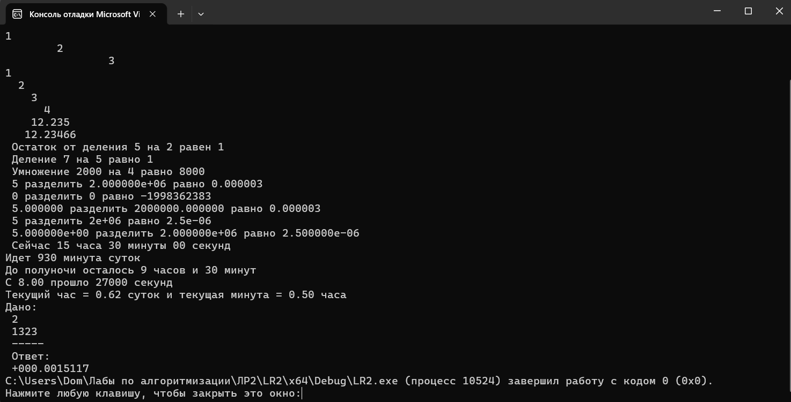

# Лабораторная работа 1

## Цель работы
Знакомство со средой разработки  MVS2022, создание проекта и написание консольного приложения.

## Результаты работы программы

## Информация о разработчике
Орлова Эльвира Эдуардовна
Группа: бИД-261
